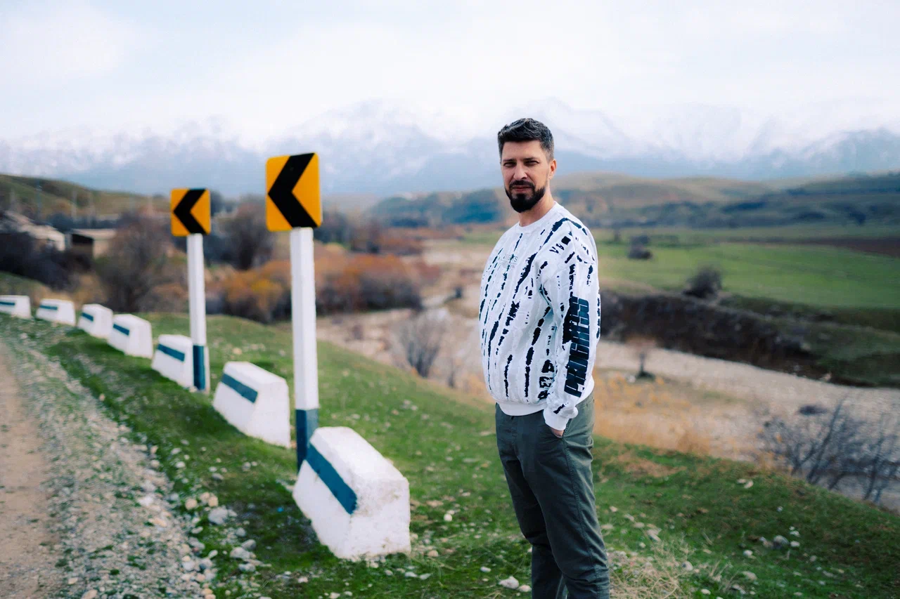

# Кратко о себе

Меня зовут Павел, и я - 46-летний менеджер по управлению франчайзингом, который учится на курсах с целью получить новую профессию QA инженера. :)  

## Опыт работы

Я имею значительный опыт в управлении проектами и командами, что позволяет мне эффективно работать в коллективе и быстро адаптироваться к новым условиям. Мои любимые вопросы на работе - - "Что?", "Где?", "Когда?" и "А что если...?", что является неотъемлемой частью работы тестировщика.

## Почему я решил стать QA инженером?

Недавно я начал интересоваться этой профессией и осознал, что у меня с тестировщиками много общего. Меня привлекла возможность докопаться до истины и решать проблемы, что соответствует моей натуре. Кроме того, я получил стимул в виде мема о том, что "душнилы" и тестировщики имеют много общего, и сразу же записался на курс **"Инженер по тестированию с нуля до middle"** на онлайн-платформе **"Нетология".** 
  

## Мои навыки и достижения

Я успешно прохожу обучение на курсах "Нетологии" и улучшаю свои знания в области тестирования программного обеспечения. Я нацелен на карьерный рост в этой области и стремлюсь получить сертификаты и знания, необходимые для работы QA инженером.

## Контакты

Если у вас есть вопросы или предложения, вы можете связаться со мной по электронной почте: <pavel.shvydkin@gmail.com> 

## Бонус  

Если вы заинтересованы в получении образования в области тестирования программного обеспечения, я могу поделиться промокодом на 10% скидку на любой курс "Нетологии"  
[Лови промокод 10% на любой курс **Нетологии**](https://netology.ru/referral-welcome/REF-G947ZN13Y)

## И это еще не всё  

